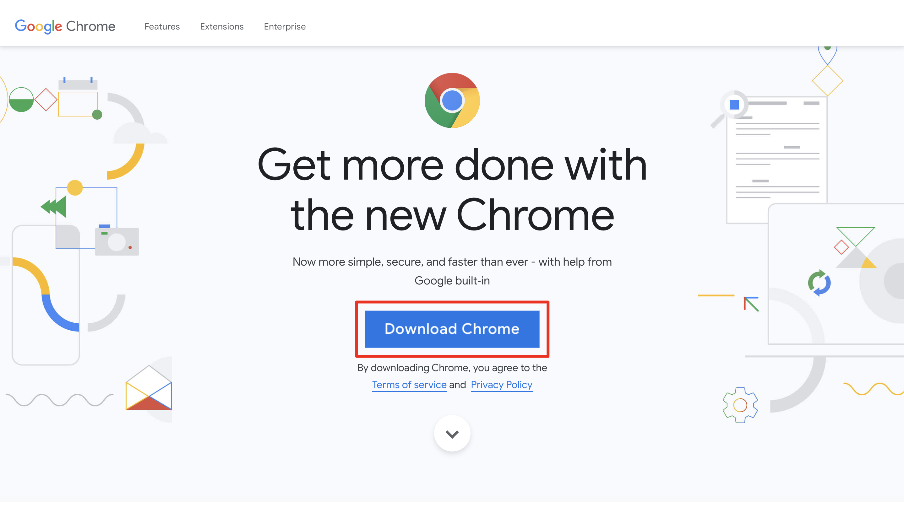
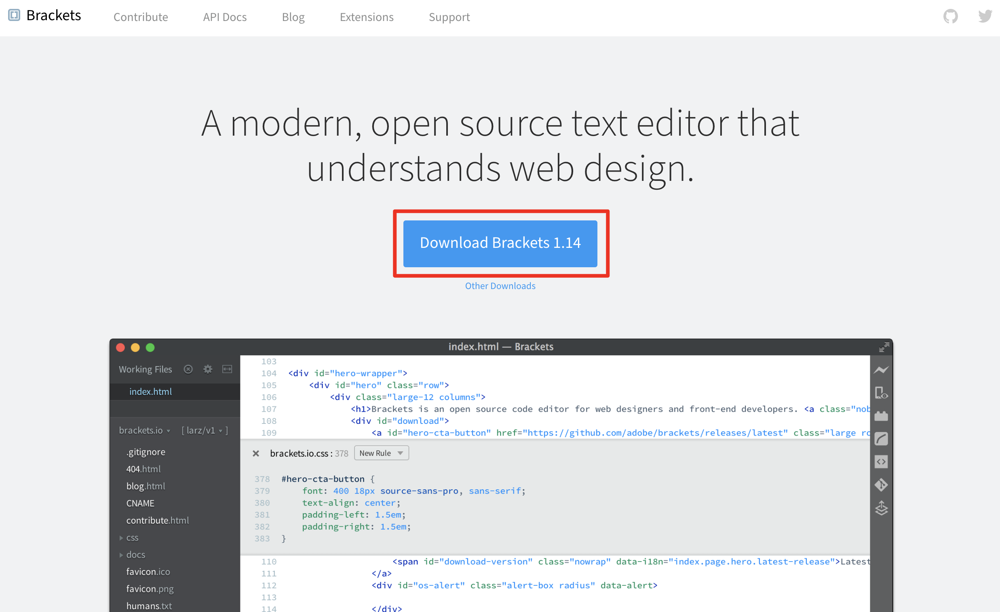

<p align="center">
  <a href="#">
    
    
    
    
    
    
    
  </a>
</p>

# TensorFlow: Data and Deployment Specialization

This repository contains the code for the course "TensorFlow: Data and Deployment Specialization" offered by [DeepLearning.AI](https://www.deeplearning.ai/). The course is available on [Coursera](https://www.coursera.org/specializations/tensorflow-data-and-deployment).

The course is divided into 4 parts:

1. Browser-based Models with TensorFlow.js
2. Device-based Models with TensorFlow Lite
3. Data Pipelines with TensorFlow Data Services
4. Advanced Deployment Scenarios with TensorFlow

## Additional note to run the basic web server using python's module http.server

The step by step to run the basic web server using python's module http.server is as follows:

1. From your terminal or command prompt, navigate to the directory where your files are located. For example, if your files are located in the Downloads folder, you would type the following command:

```bash
cd Downloads
```

2. Once you are in the correct directory, you can start the server by typing the following command:

```bash
python -m http.server
```

You should see an output similar to the following:

Serving HTTP on 0.0.0.0 port 8000 (http://0.0.0.0:8000/) ...

3. Open your web browser and type: `0.0.0.0:8000/<filename of the HTML file>` in the address bar. For example, if your HTML file is named `index.html`, you would type the following in the address bar (or whatever IP address was printed out in step 2). For example: 0.0.0.0:8000/C1_W1_assignment.html.

## Getting Your System Ready
In this course, you will be running all the examples and exercises locally on your machine. Consequently, you will need to have an internet browser, an HTML editor, and a web server installed on your machine. At the time of recording, Laurence used Chrome as the internet browser,  Brackets as the HTML editor and the Web Server for Chrome App as the web server. All of these are free and are available for various platforms including Windows, Mac OS, and Linux. Below, we will go over the installation process of each of these. Of course, you are welcome to use any software that you like, but we recommend that you install the recommended software so that it is easier for you to follow along. 

### Chrome
To install the Chrome browser, simply visit the [Chrome home page](https://www.google.com/chrome/).



Click the blue "Download Chrome" button to download the installation file to your machine.

**Install Chrome on Windows**

1. If prompted, click Run or Save.

2. If you chose Save, double-click the downloaded file to start installing.

3. Start Chrome.

**Install Chrome on Mac**

1. Open the file called googlechrome.dmg.

2. In the window that opens, find Chrome .

3. Drag Chrome to the Applications folder.

4. Open Chrome.

5. Open Finder.

6. In the sidebar, to the right of Google Chrome, click Eject.

**Install Chrome on Linux**

1. Use the same software that installs programs on your computer to install Chrome. You'll be asked to enter the administrator account password.

2. To open the package, click OK.

3. Click Install Package.

Google Chrome will be added to your software manager so it stays up-to-date.

NOTE: It is very important that you use the latest version of Chrome in order for the exercises to run. So make sure you have the latest version of Chrome installed. The current latest version is: 78.0.3904.108. 


### Web Server
The [Web Server for Chrome App](https://chrome.google.com/webstore/detail/web-server-for-chrome/ofhbbkphhbklhfoeikjpcbhemlocgigb?hl=en) used at the time of recording is no longer supported in most operating systems (now only runs on Chrome OS). But don't worry! You can use these alternatives instead:

**Option 1**: The [Simple Webserver](https://simplewebserver.org/)
 is a standalone application that is a continuation of the Chrome App
 used in this course. The interface is the same so you should be able to follow the videos easily. You can download it [here](https://simplewebserver.org/download.html)
 and install on your computer.

**Option 2**: If you already have 
[Python](https://www.python.org) installed on your computer, you can use its bundled 
[http.server](https://docs.python.org/3/library/http.server.html) module to run a basic web server. Here are the steps to use it:

1. From your Terminal/PowerShell/Command Prompt, navigate to the folder of an ungraded lab/assignment.

2. From there, type: python3 -m http.server. You should see an output like: Serving HTTP on 0.0.0.0 port 8000 (http://0.0.0.0:8000/) ...

3. Open your web browser and type: 0.0.0.0:8000/<filename of the HTML file> in the address bar (or whatever IP address was printed out in step 2). For example: 0.0.0.0:8000/C1_W1_assignment.html.


**Brackets**
To install the Brackets, simply visit the 
[Brackets home page](http://brackets.io/). 



Click on the blue "Download Brackets" button to download the installation file to your machine.

**Note: On September 1, 2021, Adobe will end support for Brackets so you might not be able to find the downloadable binaries  (Download Brackets button) directly on their website. You can still find them in their [Github repo releases section](https://github.com/adobe/brackets/releases)**. 

For Windows, v1.14.2 download link can be found [here](https://github.com/adobe/brackets/releases/download/release-1.14.2/Brackets.Release.1.14.2.msi).

For Mac, v1.14.2 download link can be found [here](https://github.com/adobe/brackets/releases/download/release-1.14.2/Brackets.Release.1.14.2.dmg).

**Install Brackets on Windows**

1. If prompted, click Run or Save.

2. If you chose Save, double-click the downloaded file to start installing.

3. Start Brackets.

4. When you open Brackets for the first time it will open a Windows Security Alter window. Click on "Allow Access" to run Brackets.

**Install Brackets on Mac**

1. Open the file called Brackets.Release.1.14.0.dmg. Note: The numbers at the end of the filename will change depending on the version that you are installing.

2. Open the downloaded file.

3. Drag Brackets to the Applications folder.

4. Open Brackets.

5. Open Finder.

6. In the sidebar, to the right of Brackets, click Eject.

**Install Brackets on Linux**

Use the same software that installs programs on your computer to install Brackets. You'll be asked to enter the administrator account password.

1. To open the [package](https://github.com/adobe/brackets/archive/refs/tags/release-1.14.2.tar.gz), click OK.

2. Click Install Package.

3. If you run into trouble installing Brackets in your Linux system, make sure to check out the Brackets Linux Guide. 

That's it! You should now be all setup to follow along.
